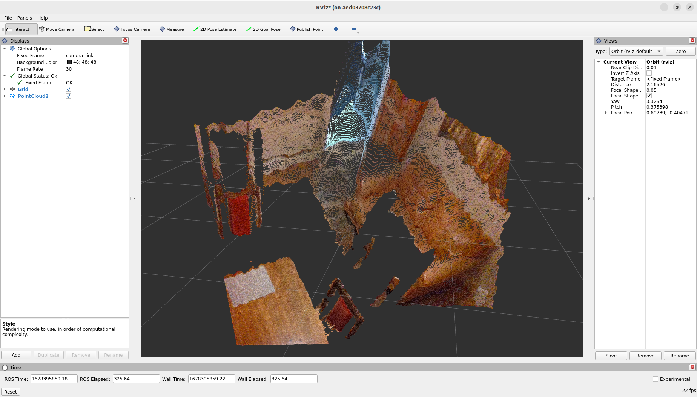

# Docker for Intel Realsense cameras on ROS 2

Author: [Tobit Flatscher](https://github.com/2b-t) (2022 - 2024)

[](https://github.com/2b-t/realsense-ros2-docker/actions/workflows/build.yml) [](https://opensource.org/licenses/MIT)


## 0. Overview
This repository contains a Docker and all the documentation required to launch an [Intel Realsense camera](https://www.intel.co.uk/content/www/uk/en/architecture-and-technology/realsense-overview.html) with the [Robot Operating System ROS 2](https://docs.ros.org/en/humble/index.html).

## 1. Creating a Docker
There are two different approaches for creating a Docker for a Realsense camera, one uses existing **Debian packages** while the other performs a full **compilation from source**. It is then important to mount `/dev` as a volume so that the Docker can access the hardware.

In the `docker-compose.yml` this is done with the options:

```yaml
    volumes:
      - /dev:/dev
    device_cgroup_rules:
      - 'c 81:* rmw'
      - 'c 189:* rmw'
```

For more information on how to obtain these device cgroup rules see [here](https://github.com/2b-t/docker-for-robotics/blob/main/doc/WorkingWithHardware.md). For running the IMU as well you will have to add [**`privileged: true`**](https://docs.docker.com/compose/compose-file/compose-file-v3/#domainname-hostname-ipc-mac_address-privileged-read_only-shm_size-stdin_open-tty-user-working_dir).

### 1.1 Installation from Debian packages

The relevant packages for `amd64` and most distributions can be installed from Debian packages. This is significantly simpler and less error prone than a full compilation from source but corresponding Debian packages might not be available for all Ubuntu versions and are sadly currently not available for `arm64`. **In the case of an `arm64` architecture you will have to go for a compilation from source as described in the next section.** The corresponding Dockerfile for `amd64` can be found below. It is based on the installation guides for [`librealsense`](https://github.com/IntelRealSense/librealsense/blob/master/doc/distribution_linux.md#installing-the-packages) and [its ROS wrapper](https://github.com/IntelRealSense/realsense-ros/tree/ros2-beta).

```Dockerfile
FROM ros:humble-perception

ENV WS_DIR="/ros2_ws"
WORKDIR ${WS_DIR}

SHELL ["/bin/bash", "-c"]

ARG DEBIAN_FRONTEND=noninteractive

RUN apt-get update \
 && apt-get install -y \
    build-essential \
    cmake \
    git-all \
    software-properties-common \
 && rm -rf /var/lib/apt/lists/*

RUN apt-get update \
 && apt-get install -y \
    ros-${ROS_DISTRO}-librealsense2* \
    ros-${ROS_DISTRO}-realsense2-* \
 && rm -rf /var/lib/apt/lists/*

RUN apt-get update \
 && apt-get install -y \
    ros-${ROS_DISTRO}-rviz2 \
 && rm -rf /var/lib/apt/lists/*

ARG DEBIAN_FRONTEND=dialog
```

### 1.2 Installation from source
The installation from source is slightly more involved but more general: It might work with ROS 2 distributions before the support is officially added (as used to be the case for ROS Humble for quite a while). In order to optimise memory usage a [multi-stage build](https://docs.docker.com/develop/develop-images/multistage-build/) is performed. The Dockerfile is inspired by the [Dockerfile of `librealsense`](https://github.com/IntelRealSense/librealsense/blob/master/scripts/Docker/Dockerfile) contributed by community members:

```Dockerfile
ARG BASE_IMAGE=ros:humble-perception

# The following steps are based on the offical multi-stage build: https://github.com/IntelRealSense/librealsense/blob/master/scripts/Docker/Dockerfile
#################################
#   Librealsense Builder Stage  #
#################################
FROM $BASE_IMAGE as librealsense-builder

SHELL ["/bin/bash", "-c"]

ENV DEBIAN_FRONTEND=noninteractive

RUN apt-get update \
 && apt-get install -qq -y --no-install-recommends \
    build-essential \
    cmake \
    git \
    libssl-dev \
    libusb-1.0-0-dev \
    pkg-config \
    libgtk-3-dev \
    libglfw3-dev \
    libgl1-mesa-dev \
    libglu1-mesa-dev \    
    curl \
    python3 \
    python3-dev \
    ca-certificates \
 && rm -rf /var/lib/apt/lists/*

WORKDIR /usr/src
# Get the latest tag of remote repository: https://stackoverflow.com/a/12704727
# Needs to be a single command as ENV can't be set from Bash command: https://stackoverflow.com/questions/34911622/dockerfile-set-env-to-result-of-command
RUN export LIBRS_GIT_TAG=`git -c 'versionsort.suffix=-' \
                         ls-remote --exit-code --refs --sort='version:refname' --tags https://github.com/IntelRealSense/librealsense '*.*.*' \
                         | tail --lines=1 \
                         | cut --delimiter='/' --fields=3`; \
    export LIBRS_VERSION=${LIBRS_VERSION:-${LIBRS_GIT_TAG#"v"}}; \
    curl https://codeload.github.com/IntelRealSense/librealsense/tar.gz/refs/tags/v${LIBRS_VERSION} -o librealsense.tar.gz; \
    tar -zxf librealsense.tar.gz; \
    rm librealsense.tar.gz; \
    ln -s /usr/src/librealsense-${LIBRS_VERSION} /usr/src/librealsense

RUN cd /usr/src/librealsense \
 && mkdir build && cd build \
 && cmake \
    -DCMAKE_C_FLAGS_RELEASE="${CMAKE_C_FLAGS_RELEASE} -s" \
    -DCMAKE_CXX_FLAGS_RELEASE="${CMAKE_CXX_FLAGS_RELEASE} -s" \
    -DCMAKE_INSTALL_PREFIX=/opt/librealsense \    
    -DBUILD_GRAPHICAL_EXAMPLES=OFF \
    -DBUILD_PYTHON_BINDINGS:bool=true \
    -DCMAKE_BUILD_TYPE=Release ../ \
 && make -j$(($(nproc)-1)) all \
 && make install
 
 ENV DEBIAN_FRONTEND=dialog

######################################
#   librealsense Base Image Stage    #
######################################
FROM ${BASE_IMAGE} as librealsense

SHELL ["/bin/bash", "-c"]

COPY --from=librealsense-builder /opt/librealsense /usr/local/
COPY --from=librealsense-builder /usr/lib/python3/dist-packages/pyrealsense2 /usr/lib/python3/dist-packages/pyrealsense2
COPY --from=librealsense-builder /usr/src/librealsense/config/99-realsense-libusb.rules /etc/udev/rules.d/
ENV PYTHONPATH=${PYTHONPATH}:/usr/local/lib

ENV DEBIAN_FRONTEND=noninteractive

RUN apt-get update \
 && apt-get install -y --no-install-recommends \	
    libusb-1.0-0 \
    udev \
    apt-transport-https \
    ca-certificates \
    curl \
    software-properties-common \
 && rm -rf /var/lib/apt/lists/*

# The following steps are based on: https://github.com/IntelRealSense/realsense-ros/tree/ros2-development
ENV WS_DIR="/ros2_ws"
WORKDIR ${WS_DIR}
RUN apt-get update -y \
 && apt-get install -y \
    ros-${ROS_DISTRO}-rviz2 \
 && mkdir src \
 && cd src \
 && git clone https://github.com/IntelRealSense/realsense-ros.git -b ros2-development \
 && cd .. \
 && apt-get install -y python3-rosdep \
 && source /opt/ros/${ROS_DISTRO}/setup.bash \
 && rm /etc/ros/rosdep/sources.list.d/20-default.list \
 && rosdep init \
 && rosdep update \
 && rosdep install -i --from-path src --rosdistro ${ROS_DISTRO} --skip-keys=librealsense2 -y \
 && colcon build

ENV DEBIAN_FRONTEND=dialog

CMD [ "rs-enumerate-devices", "--compact" ]
```

## 2. Launching
Allow the container to display contents on your host machine by typing

```bash
$ xhost +local:root
```

Then build the Docker container with

```shell
$ docker compose -f docker-compose-gui.yml build
```
or directly with the [`devcontainer` in Visual Studio Code](https://code.visualstudio.com/docs/devcontainers/containers). For Nvidia graphic cards the file `docker-compose-gui-nvidia.yml` in combination with the [`nvidia-container-runtime`](https://nvidia.github.io/nvidia-container-runtime/) has to be used instead.
After it is done building **connect the Realsense**, start the container

```shell
$ docker compose -f docker-compose-gui.yml up
```
and see if you can **detect it from inside the Docker** by typing inside the Docker
```shell
$ rs-enumerate-devices --compact
```
Turn on the camera inside the application, see if you can see a three-dimensional image. Finally we can **launch the ROS 2 wrapper**
```shell
$ ros2 launch realsense2_camera rs_launch.py pointcloud.enable:=true
```
and in another terminal the ROS visualiser Rviz
```shell
$ ros2 run rviz2 rviz2
```
In Rviz you can then display the topics published by the Realsense. For the list of available topics use
```shell
$ ros2 topic list
```
in combination with
```shell
$ ros2 topic info <topic_name>
```
to find out what display type has to be selected in Rviz.




## 3. Debugging

The Intel Realsense driver has several serious flaws/bugs. In case this Docker image does not work for you please have a look at the [issues on `realsense-ros`](https://github.com/IntelRealSense/realsense-ros/issues) to see if somebody has encountered the same issue already. Issues you might encounter are likely related to the underlying fragile library itself.

- The driver is **closely connected to the [kernel version of the Linux operating system](https://github.com/IntelRealSense/librealsense/issues/9360)**. If the Dockerfile above do not work then you are likely unlucky and it is an incompatible version of the kernel of your host system and you will either have to [downgrade your kernel](https://linuxhint.com/install-linux-kernel-ubuntu/) or switch to another Ubuntu version that is officially supported.

- The Realsense is **pretty [picky about USB 3.x cables](https://github.com/IntelRealSense/librealsense/issues/2045)**. If your camera is detected via `rs-enumerate-devices`, you can see it `realsense-viewer` but can't output its video stream, then it might be that your cable lacks the bandwidth. Either you can try to turn down the resolution of the camera in the `realsense-viewer` or switch cable (preferably to one that is [already known to work](https://community.intel.com/t5/Items-with-no-label/long-USB-cable-for-realsense-D435i/m-p/694963)).

- The Realsense ROS driver itself is known for **struggling with [Nvidia Jetson embedded computers](https://github.com/IntelRealSense/realsense-ros/issues?q=jetson+) and [Raspberry Pi single-board computers](https://github.com/IntelRealSense/realsense-ros/issues?q=raspberry)**. Some users seem to have had success by up- or downgrading the versions of `librealsense` and/or the camera firmware but it might as well be that you find exactly the issue that you are encountering but it was never solved and closed due to inactivity (see also the issues [#2](https://github.com/2b-t/realsense-ros2-docker/issues/2) and [#4](https://github.com/2b-t/realsense-ros2-docker/issues/4)).

- A useful tool to check if the Realsense is working properly without ROS is the Realsense viewer. It can be installed as discussed in [issue #3](https://github.com/2b-t/realsense-ros2-docker/issues/3) and launched with:

  ```shell
  $ realsense-viewer
  ```

- In case you want to also use the **IMU** present in some Realsense models such as the D435i with e.g.
  ```
  $ ros2 launch realsense2_camera rs_launch.py pointcloud.enable:=true enable_gyro:=true enable_accel:=true unite_imu_method:=2
  ```

  it seems like the only way for this is to run the container with the [**`privileged`** flag](https://docs.docker.com/compose/compose-file/compose-file-v3/#domainname-hostname-ipc-mac_address-privileged-read_only-shm_size-stdin_open-tty-user-working_dir). For more details see [issue #5](https://github.com/2b-t/realsense-ros2-docker/issues/5).
